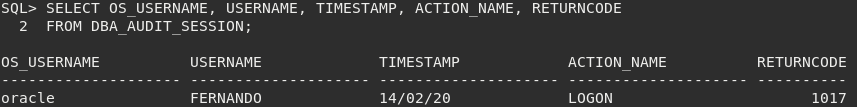
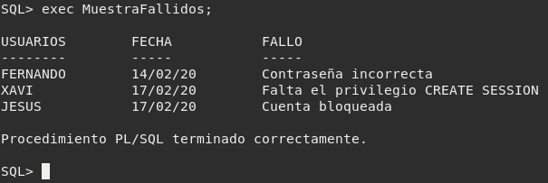
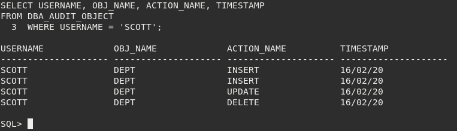
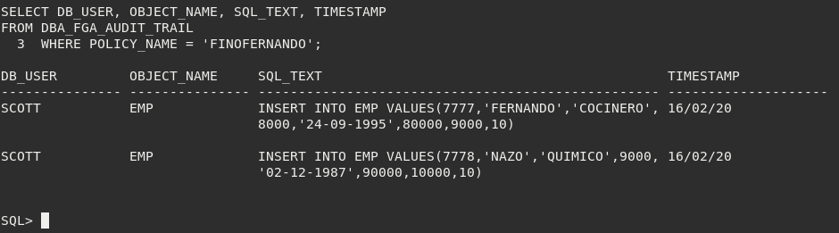
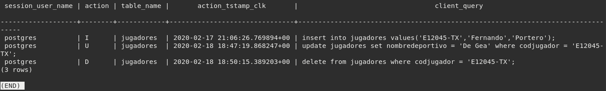
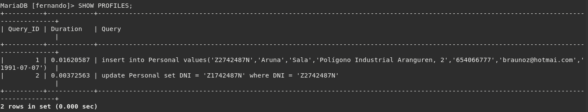

# AUDITORÍA

### 1. Activa desde SQL*Plus la auditoría de los intentos de acceso fallidos al sistema. Comprueba su funcionamiento.

Vamos a comprobar que efectivamente las auditorías estan activadas y que, en este caso, los registros se almacenan en la base de datos, ya que tiene el valor "DB":

~~~
SQL> select name, value from v$parameter where name like 'audit_trail';

NAME		     VALUE
-------------------- --------------------
audit_trail	     DB
~~~

En caso de que estuviese desactivada (es decir, que la columna "VALUE" tuviese el valor "NONE"), podríamos activarla de la siguiente manera:

~~~
ALTER SYSTEM SET audit_trail=db scope=spfile;
~~~

Ahora vamos a activar la auditoría que detecte los intentos de acceso fallidos:

~~~
SQL> AUDIT CREATE SESSION WHENEVER NOT SUCCESSFUL;

Auditoría terminada correctamente.
~~~

Vamos a realizar un intento fallido y vemos como se ha registrado:

~~~
SQL> conn fernando/fernand;
ERROR:
ORA-01017: invalid username/password; logon denied
~~~

### 2. Realiza un procedimiento en PL/SQL que te muestre los accesos fallidos junto con el motivo de los mismos, transformando el código de error almacenado en un mensaje de texto comprensible.

Este ejercicio ha sido realizado mediante un procedimiento y una función de apoyo:

~~~
create or replace function SignificadoCod (p_coderror NUMBER)
return VARCHAR2
is
	v_significado VARCHAR2(50);
begin
	case
		when p_coderror = 1017 then
			v_significado:='Contraseña incorrecta';
		when p_coderror = 1045 then
			v_significado:='Falta el privilegio CREATE SESSION';
		when p_coderror = 28000 then
			v_significado:='Cuenta bloqueada';
		else
			v_significado:='Error imprevisto';
	end case;
return v_significado;
end;
/
~~~

~~~
create or replace procedure MuestraFallidos
is
	cursor c_fallidos
	is
	select username, timestamp, returncode
	from dba_audit_session
	where action_name = 'LOGON';

	v_significado VARCHAR2(50);
begin
	dbms_output.put_line(chr(10)||'USUARIOS'||chr(9)||'FECHA'||chr(9)||chr(9)||'FALLO');
	dbms_output.put_line('--------'||chr(9)||'-----'||chr(9)||chr(9)||'-----');
	for i in c_fallidos loop
		v_significado:=SignificadoCod(i.returncode);
		dbms_output.put_line(RPAD(i.username,15)||' '||RPAD(i.timestamp,15)||' '||RPAD(v_significado,50));
	end loop;
end;
/
~~~

Para comprobar, creamos un usuario sin el privilegio CREATE SESSION e intentamos entrar; y además, bloqueamos un usuario e intentamos entrar:

### 3. Activa la auditoría de las operaciones DML realizadas por SCOTT. Comprueba su funcionamiento.

Activamos la auditoría pedida:

~~~
SQL> AUDIT INSERT TABLE, UPDATE TABLE, DELETE TABLE BY SCOTT;

Auditoría terminada correctamente.
~~~

Ahora vamos a realizar un insert, un delete y un update:

~~~
SQL> INSERT INTO DEPT VALUES(70,'LIMPIEZA','SEVILLA');

1 fila creada.

SQL> UPDATE DEPT SET DNAME='TRANSPORTE' WHERE DEPTNO=70;

1 fila actualizada.

SQL> DELETE FROM DEPT WHERE DEPTNO=70;

1 fila suprimida.
~~~

Comprobamos:

### 4. Realiza una auditoría de grano fino para almacenar información sobre la inserción de empleados del departamento 10 en la tabla emp de scott.

La auditoría de grano fino (FGA) extiende la auditoría estándar y captura la sentencia SQL que ha sido ejecutada.

Creamos la auditoría de grano fino:

~~~
SQL> begin
  2  DBMS_FGA.ADD_POLICY (
  3  OBJECT_SCHEMA      => 'SCOTT',
  4  OBJECT_NAME        => 'EMP',
  5  POLICY_NAME        => 'FINOFERNANDO',
  6  AUDIT_CONDITION    => 'DEPTNO = 10',
  7  STATEMENT_TYPES    => 'INSERT'
  8  );
  9  end;
 10  /

Procedimiento PL/SQL terminado correctamente.
~~~

Realizamos un par de inserciones en el departamento especificado:

~~~
SQL> INSERT INTO EMP VALUES(7777,'FERNANDO','COCINERO',8000,'24-09-1995',80000,9000,10);

1 fila creada.

SQL> INSERT INTO EMP VALUES(7778,'NAZO','QUIMICO',9000,'02-12-1987',90000,10000,10);

1 fila creada.
~~~

Comprobamos la información almacenada:

### 5. Explica la diferencia entre auditar una operación by access o by session.

Mientras que la opción BY ACCESS almacena un registro por cada acción realizada independientemente de si es repetida o no; la opción BY SESSION almacena un solo registro de una misma acción que hagamos, evitando repetirlas.

La opción por defecto en Oracle 12c es BY ACCESS, mientras que en versiones anteriores era BY SESSION.

### 6. Documenta las diferencias entre los valores db y db, extended del parámetro audit_trail de ORACLE. Demuéstralas poniendo un ejemplo de la información sobre una operación concreta recopilada con cada uno de ellos.

El parámetro "audit_trail" lo usamos anteriormente para activar o desactivar las auditorías.
Las diferencias entre las 2 indicadas son:

- db: Activa la auditoría y los datos se almacenarán en la tabla SYS.AUD$ de Oracle.
- db, extended: Activa la auditoría y los datos se almacenarán en la tabla SYS.AUD$, como en la anterior, pero con la diferencia de que además, se escribirán los valores correspondientes en las columnas SQLBIND y SQLTEXT de la tabla SYS.AUD$.

### 7. Localiza en Enterprise Manager las posibilidades para realizar una auditoría e intenta repetir con dicha herramienta los apartados 1, 3 y 4.

### 8. Averigua si en Postgres se pueden realizar los apartados 1, 3 y 4. Si es así, documenta el proceso adecuadamente.

PostgreSQL no tiene incluida nativamente una herramienta de auditorías, por lo que investigando, he dado con una herramienta creada por la comunidad para poder realizarlas.

Esta herramienta se llama "Audit trigger 91plus" y consiste básicamente en una recopilación de scripts y triggers haciendo uso en parte de PL/pgSQL:

~~~
postgres@psqlserver:~$ wget https://raw.githubusercontent.com/2ndQuadrant/audit-trigger/master/audit.sql
~~~

Nos conectamos a postgresql y ejecutamos con \i los comandos del fichero descargado:

~~~
postgres=# \i audit.sql
~~~

Una vez hecho esto, hacemos varias acciones DML en una tabla que tengamos:

~~~
postgres=# insert into jugadores values('E12045-TX','Fernando','Portero');
INSERT 0 1
postgres=# update jugadores set nombredeportivo = 'De Gea' where codjugador = 'E12045-TX';
UPDATE 1
postgres=# delete from jugadores where codjugador = 'E12045-TX';
DELETE 1
~~~

Y miramos en la tabla que nos indica la documentación las opciones más interesantes:

~~~
postgres=# select session_user_name, action, table_name, action_tstamp_clk, client_query
from audit.logged_actions;
~~~

Podríamos ver que hemos podido realizar una auditoría ya que con esta consulta hemos podido visualizar las consultas DML y de grano fino, ya que hemos visto la sentencia introducida.

### 9. Averigua si en MySQL se pueden realizar los apartados 1, 3 y 4. Si es así, documenta el proceso adecuadamente.

En MariaDB tan solo tenemos que activar el siguiente parámetro:

~~~
MariaDB [fernando]> SET SESSION profiling = 1;
Query OK, 0 rows affected (0.000 sec)
~~~

Insertamos y actualizamos una tabla:

~~~
MariaDB [fernando]> insert into Personal values('Z2742487N','Aruna','Sala','Polígono Industrial Aranguren, 2','654066777','braunoz@hotmai.com','1991-07-07');
Query OK, 1 row affected (0.016 sec)

MariaDB [fernando]> update Personal set DNI = 'Z1742487N' where DNI = 'Z2742487N';
Query OK, 1 row affected (0.004 sec)
Rows matched: 1  Changed: 1  Warnings: 0
~~~

Comprobamos:

### 10.  Averigua las posibilidades que ofrece MongoDB para auditar los cambios que va sufriendo un documento.

### 11.  Averigua si en MongoDB se pueden auditar los accesos al sistema.

Para auditar los accesos al sistema se usa la siguiente sentencia:

~~~
{ atype: "authenticate", "param.db": "test" }
~~~
